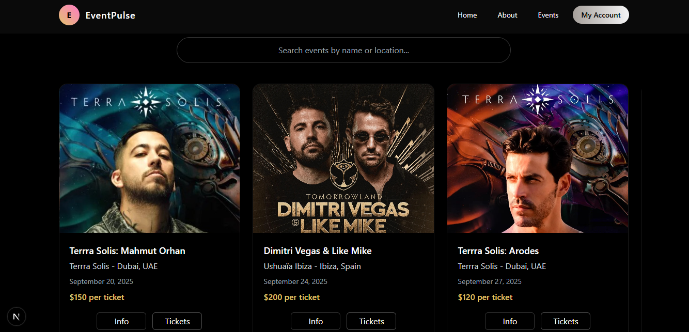

# Event Booking Website

A full functional event booking website built with React, Tailwind CSS, Node.js, and Express.js. It enables users to explore events and book tickets through a secure, responsive, and visually refined interface powered by NextAuth.js and modern frontend animations.

## View Project

To view or edit the project:

```bash
git clone https://github.com/Kethnulee-Weerasinghe4/Event-Booking-Website.git
cd Event-Booking-Website
```
## Installation

```bash
cd NEWS-Website
npm install
npm run dev
```



## Features

- Browse upcoming events through a dynamic interface
- Book and cancel event tickets securely
- Interactive calendar to track upcoming events
- Secure user authentication and sessions  
- Smooth animations and clean, mobile-friendly design
   
## Technologies

# Frontend

- JavaScript
- React
- Tailwind CSS

# Backend

- Node.js
- NextAuth.js
- Express.js
- CORS
- bcrypt
